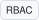

<!--
  ============================================================================
  YASSINE LAMSAAF | GITHUB PROFILE README

  MAINTENANCE
  1. Every technology and contact icon is a small self-hosted card generated by
       powershell -File tools/build-icons.ps1     # rebuild
       python tools/validate-icons.py             # geometry + XML checks
     Marks come from the Iconify API (iconify.design), which carries brand
     colours and, unlike shields.io, actually has a LinkedIn and a phone icon.
     Self-hosting means the page never depends on a third-party CDN to render.
  2. Cards are 20px tall, square-cornered and exactly as wide as [mark][label].
     Stack cards take their category's tint and butt up against each other; the
     five contact cards share one neutral fill and their marks are flattened to a
     single ink colour. A card supplies its own light background, so monochrome
     marks (Next.js #000, Express #222) stay legible on GitHub's dark theme
     without recolouring anything.
  3. To show the contribution animation, delete the 
 wrapper around
     "Contribution animation" in the GitHub Activity section.
  ============================================================================
-->

 

 

&nbsp;&nbsp;
&nbsp;&nbsp;
&nbsp;&nbsp;
&nbsp;&nbsp;

 

---

## About

Software engineering student at the **Institut National des Postes et Télécommunications (INPT)** in Rabat, Morocco, working across the whole stack: data model, API, interface, and the pipeline that ships it.

I like the parts that are hard to keep correct as a system grows: distributed workflows, real-time data, identity and access control, and delivery pipelines a team can trust.

- **Focus** | full-stack development, distributed systems, cloud infrastructure
- **Exploring** | retrieval-augmented generation and tool-calling agents
- **Languages** | Arabic (native), French (conversational), English (proficient)

---

## Education

| Institution | Qualification | Period |
|:---|:---|:---|
| **INPT**, Rabat | Engineering Degree, Software Engineering | Sep 2024 – Jun 2027 |
| **FSTG**, Marrakech | DEUST in MIPC, mathematics / computing / physics / chemistry | Sep 2022 – Jul 2024 |

---

## Stack

### Languages

### Frontend

### Backend

### Databases

### DevOps & Cloud

<b>Full reference</b>

 

| Area | Technologies |
|:---|:---|
| **Languages** | Java, JavaScript, TypeScript, Python, C, C++ |
| **Frontend** | React, Next.js, Angular, Tailwind CSS, Vite, HTML5, CSS3 |
| **Backend** | Spring Boot, Spring Security (JWT, RBAC), Hibernate, Node.js, Express.js, gRPC, REST APIs, WebSocket / STOMP |
| **Databases** | PostgreSQL, pgvector, MySQL, MongoDB, Redis, Firebase, Supabase |
| **DevOps & Cloud** | Docker, Docker Compose, Kubernetes, Argo CD, GitHub Actions, Git, Linux, SSH, Nginx, Maven, Kafka, Ollama |
| **Architecture** | Microservices, distributed systems, event-driven design, DDD, API Gateway, CI/CD, GitOps |
| **Practices** | Agile / Scrum, code review, technical documentation |

---

## GitHub Activity

<b>Contribution animation</b>

 

<picture>
  <source media="(prefers-color-scheme: dark)" srcset="https://raw.githubusercontent.com/yassinelamsaaf/yassinelamsaaf/output/github-contribution-grid-snake-dark.svg" />
  <source media="(prefers-color-scheme: light)" srcset="https://raw.githubusercontent.com/yassinelamsaaf/yassinelamsaaf/output/github-contribution-grid-snake.svg" />
  
</picture>

 

 

<a href="mailto:lamsaafyassine20@gmail.com">lamsaafyassine20@gmail.com</a>

<!--
Marks are from the Iconify API (https://iconify.design), released under CC0 1.0.
All product names and logos are trademarks of their respective owners.
-->